# STARS AND AWARDS: Unraveling 'Epic TV Adventures' Dataset Analysis"

## ABOUT THE DATASET 
The dataset, powered by SQL, delves into "Epic TV Adventures," covering awards, characters, credits, episodes, persons, and votes. SQL queries provide key insights into award distribution, organizational achievements, individual contributions, and viewer engagement. This dataset is a valuable resource for making informed decisions to ensure the ongoing success of "Epic TV Adventures."

Insight to be Gained:

To discover details about awards, unique organizations, character award counts, top-rated episodes, average person height, highly voted episodes, organizational success, relationships, individual achievements, and episode comparisons. SQL's analytical capabilities make this dataset essential for navigating the dynamic world of television entertainment.

## QUESTIONS TO LEAD TO THE INSIGHT

1. Retrieve all columns from the "Award" table.
2. List unique organizations from the "Award" table.
3. Count the total number of records in the "Character_Award" table.
4. Display the distinct roles from the "Credit" table.
5. Find the maximum and minimum birthdates from the "Person" table.
6. List the top 5 episodes with the highest ratings.
7. Calculate the average height of persons in meters from the "Person" table.
8. Identify episodes with more than 100 votes in the "Episode" table.
9. Count the number of awards won by each organization.
10. Retrieve the names of persons who have not been credited in any episode.
11. Find the episode with the most keywords.
12. Calculate the average number of votes per episode.
13. Identify persons who have won awards in multiple categories.
14. List the top 3 most common birthplaces in the "Person" table.
15. Calculate the percentage of votes for each episode in the "Vote" table.
16. Determine the person with the most credited roles in episodes.
17. Find the organization with the highest number of awards in a specific year.
18. Identify episodes that share keywords with a given episode.
19. Calculate the total number of awards won by each person.
20. Find episodes with the same ratings and display their details.

# SQL CODE DEPLOYMENT

## QUESTION 1: 
### RETRIEVE ALL COLUMNS FROM THE "AWARD" TABLE..

# Looking at the Actors and Award dataset shows us all about actors and their achievements. It helps stakeholders understand and celebrate successes, make smart decisions, and recognize talent. Also, getting all columns from the "Award" table gives a full picture of awards in "Epic TV Adventures," recognizing achievements and diverse talents that make the series a success.

## CODE
SELECT * FROM [dbo].[Award]

## OUTPUT
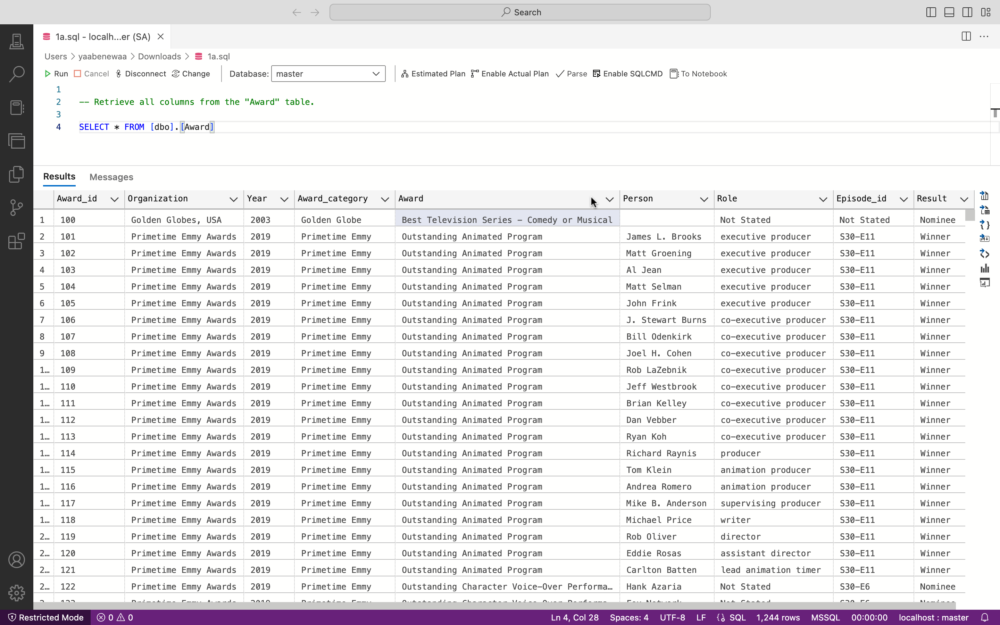

## QUESTION 2: 
## LIST UNIQUE ORGANIZATIONS FROM THE "AWARD" TABLE.

# Listing unique organizations from the "Award" table shows the variety of entities acknowledging achievements. This helps understand the series' standing, assess the network of accolades, and recognize the diverse support contributing to its success.

## CODE
SELECT DISTINCT [Organization] AS [THE DIVERSE ORGANIZATION] FROM [dbo].[Award]

## OUTPUT
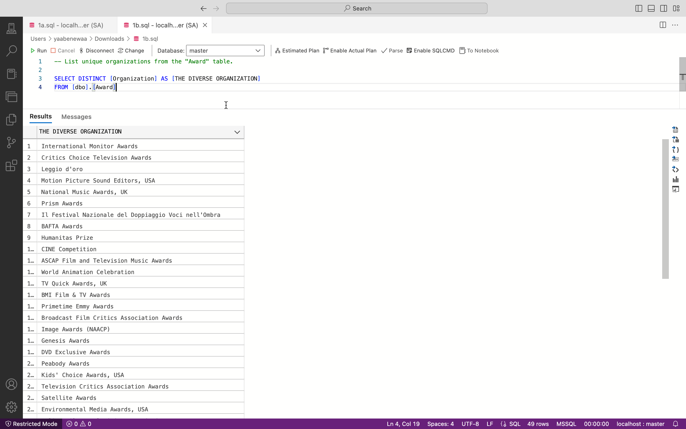

## QUESTION 3: 
## COUNT THE TOTAL NUMBER OF RECORDS IN THE "CHARACTER_AWARD" TABLE.
# Counting the total number of records in the "Character_Award" table provides a straightforward metric of how many character awards exist. This insight gives a quantitative overview of the recognition received by characters in the series.

## CODE
SELECT COUNT(*) AS [TOTAL NUMBER OF RECORDS] FROM [dbo].[Character_Award]

## OUTPUT

## QUESTION 4: 
## DISPLAY THE DISTINCT ROLES FROM THE "CREDIT" TABLE.
# Displaying the distinct roles from the "Credit" table offers a clear view of the diverse roles associated with the series. This insight helps recognize the breadth of contributions from various individuals, providing an understanding of the collaborative efforts behind the scenes.

## CODE
SELECT DISTINCT [role] AS [THE VARIOUS ROLES]FROM [dbo].[Credit]

## OUTPUT

## QUESTION 5: 
## FIND THE MAXIMUM AND MINIMUM BIRTHDATES FROM THE "PERSON" TABLE.
# Listing unique organizations from the "Award" table shows the variety of entities acknowledging achievements. This helps understand the series' standing, assess the network of accolades, and recognize the diverse support contributing to its success.

## CODE
SELECT MAX([birthdate]) AS [OLDEST DATE OF BIRTH],MIN([birthdate]) AS [YOUNGEST DATE OF BIRTH] FROM [dbo].[Person]

## OUTPUT

## QUESTION 6: 
## LIST THE TOP 5 EPISODES WITH THE HIGHEST RATINGS.
# Listing the top 5 episodes with the highest ratings offers insights into the most acclaimed and viewer-favored content. This information guides the understanding of audience preferences, enabling content creators to identify successful storytelling elements for future episodes

## CODE
SELECT TOP 5 [title] AS [TITLE],[episode_id] AS [EPISODE ID],[rating] AS [TOP RATINGS]
,[episode] AS [TOP EPISODE] FROM [dbo].[Episode] ORDER BY [rating] DESC

## OUTPUT

## QUESTION 7: 
## FIND THE ORGANIZATION WITH THE HIGHEST NUMBER OF AWARDS IN A SPECIFIC YEAR.
# Identifying the organization with the highest number of awards in a specific year provides insights into which entity dominated the accolades during that period. This information helps gauge industry recognition, understand organizational achievements, and potentially uncover trends in award distribution over time.

## CODE
SELECT TOP 1 [Organization],COUNT(*) AS [NUMBER OF AWARDS] FROM [dbo].[Award] WHERE [Year] = '2014'GROUP BY [Organization] ORDER BY [NUMBER OF AWARDS] DESC;

## OUTPUT
 

## QUESTION 8: 
## CALCULATE THE AVERAGE NUMBER OF VOTES PER EPISODE.
# Calculating the average number of votes per episode offers insights into the level of viewer engagement and popularity of each episode. This metric helps gauge the overall reception of the series and identify episodes that resonate most with the audience, aiding in content planning and strategy.

## CODE
SELECT 
AVG([votes]) AS [NUMBER OF VOTES PER EPISODE] FROM [dbo].[Episode]

## OUTPUT
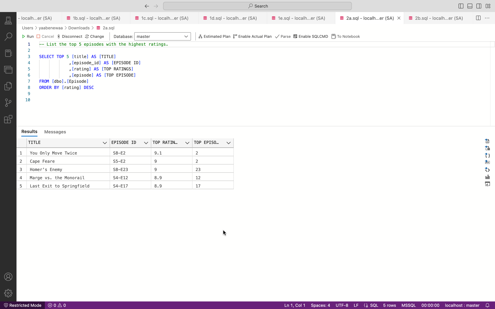

## QUESTION 9: 
## IDENTIFY EPISODES WITH MORE THAN 100 VOTES IN THE "EPISODE" TABLE.
# Identifying episodes with more than 100 votes in the "Episode" table provides insights into the popularity threshold within the series. This information helps pinpoint episodes that have garnered significant viewer attention, indicating high engagement and potential areas of focus for analysis or promotion.

## CODE
SELECT [episode_id] AS [EPISODE ID],[title] AS [TITLE],[votes] AS [NUMBER OF VOTES]
FROM [dbo].[Episode] WHERE [votes] > 100 

## OUTPUT

## QUESTION 10: 
## COUNT THE NUMBER OF AWARDS WON BY EACH ORGANIZATION
# Counting the number of awards won by each organization provides a quantitative understanding of the distribution of accolades. This insight helps identify which organizations have consistently excelled in recognizing achievements, contributing to a comprehensive view of industry acknowledgment and success.

## CODE
SELECT COUNT(*) AS [NUMBER OF AWARDS WON],[Organization] AS [ORGANIZATIONS] FROM [dbo].[Award] GROUP BY  [Organization] ORDER BY [NUMBER OF AWARDS WON] DESC

## OUTPUT

## QUESTION 11: 
## RETRIEVE THE NAMES OF PERSONS WHO HAVE NOT BEEN CREDITED IN ANY EPISODE.
# Retrieving the names of persons who have not been credited in any episode sheds light on individuals possibly overlooked in the series' acknowledgment. This insight helps recognize contributors who may require additional acknowledgment or investigation into their roles within the production.

## CODE
SELECT [name] AS [NAMES OF INDIVIDUALS WHO HAVE NOT BEEN CREDITED] FROM [dbo].[Person] WHERE [name] NOT IN (SELECT DISTINCT [person] 
FROM [dbo].[Credit]) ORDER BY [NAMES OF INDIVIDUALS WHO HAVE NOT BEEN CREDITED] 

## OUTPUT
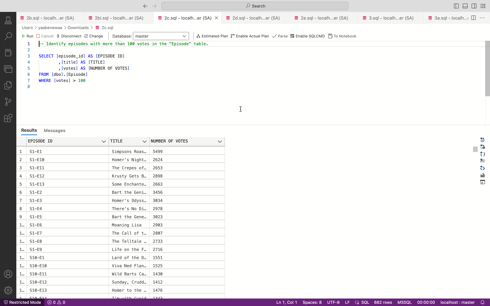

## QUESTION 12: 
## CALCULATE THE AVERAGE HEIGHT OF PERSONS IN METERS FROM THE "PERSON" TABLE.
# Calculating the average height of persons in meters from the "Person" table provides insights into the physical attributes of individuals associated with the series. This information aids in understanding the diversity of heights among the cast and crew, contributing to a more comprehensive characterization of the personnel involved.

## CODE
SELECT ROUND(AVG([height_meters]),2)  AS [AVERAGE HEIGHT OF PERSONS] FROM [dbo].[Person]

## OUTPUT
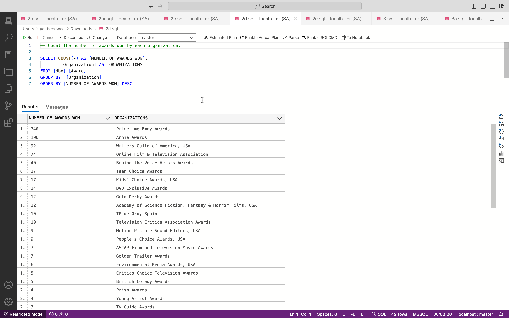

## QUESTION 13: 
## FIND THE EPISODE WITH THE MOST KEYWORDS.
# Finding the episode with the most keywords provides insights into the richness and complexity of its thematic content. This information helps understand the depth of narrative elements, allowing creators to identify episodes with intricate storytelling and potentially uncover patterns in keyword usage across the series.

## CODE
SELECT TOP 1 [episode_id] AS [EPISODE ID],COUNT(*) AS [NUMBER OF KEYWORDS] FROM [dbo].[Keyword] GROUP BY [episode_id] ORDER BY [NUMBER OF KEYWORDS] DESC

## OUTPUT

## QUESTION 14: 
## CALCULATE THE AVERAGE HEIGHT OF PERSONS IN METERS FROM THE "PERSON" TABLE.
# Understanding the average height of persons aids in creating a more nuanced portrayal of characters in the series. This insight can influence casting decisions, character development, and contribute to a more realistic representation of individuals within the production.

## CODE
SELECT ROUND(AVG([height_meters]),2)  AS [AVERAGE HEIGHT OF PERSONS] FROM [dbo].[Person]

## QUESTION 15: 
## IDENTIFY PERSONS WHO HAVE WON AWARDS IN MULTIPLE CATEGORIES.
# Recognizing these individuals with multiple awards underlines their versatile talents, showcasing their significant contributions to the series. This insight can guide future collaborations and decision-making, ensuring continued success in the industry.

## CODE
SELECT 
NULLIF(LTRIM(RTRIM([Person])), '') AS [PEOPLE WHO WON AWARDS], COUNT(DISTINCT [Award_category]) AS [THE VARIOUS CATEGORIES] FROM [dbo].[Award] 
WHERE [Person]IS NOT NULL AND NULLIF(RTRIM(LTRIM([Person])), '') IS NOT NULL
GROUP BY [Person] HAVING COUNT(DISTINCT [Award_category]) > 1

## OUTPUT

## QUESTION 16: 
## LIST THE TOP 3 MOST COMMON BIRTHPLACES IN THE "PERSON" TABLE.
# Understanding the most common birthplaces contributes to a richer characterization of the series' personnel. Insights into geographic patterns enable producers and stakeholders to appreciate the diversity and cultural representation within the team. This information can influence decisions related to casting, storytelling, and fostering an inclusive working environment.

## CODE
SELECT TOP 3 NULLIF(LTRIM(RTRIM([birth_place])), '') AS cleaned_birth_place,
COUNT(*) AS birthplace_count FROM [dbo].[Person] WHERE [birth_place] IS NOT NULL AND NULLIF(LTRIM(RTRIM([birth_place])), '') IS NOT NULL GROUP BY NULLIF(LTRIM(RTRIM([birth_place])), '') ORDER BY birthplace_count DESC;

## OUTPUT

## QUESTION 17: 
## CALCULATE THE PERCENTAGE OF VOTES FOR EACH EPISODE IN THE "VOTE" TABLE.
# Understanding the percentage of votes for each episode guides content creators in tailoring future productions to align with viewer preferences. High-percentage episodes can be analyzed for successful storytelling elements, while lower-performing episodes may be assessed for improvement. This insight empowers strategic decisions to enhance audience engagement and overall satisfaction with the series.

## CODE
SELECT [episode_id],
COUNT(DISTINCT [episode_id]) AS [THE VARIOUS EPISODES] ,[votes] AS [NUMBER OF VOTES]
,[percent] AS [PERCENTAGE OF VOTES] FROM [dbo].[Vote] GROUP BY [votes], [percent], [episode_id] ORDER BY [votes] DESC

## OUTPUT
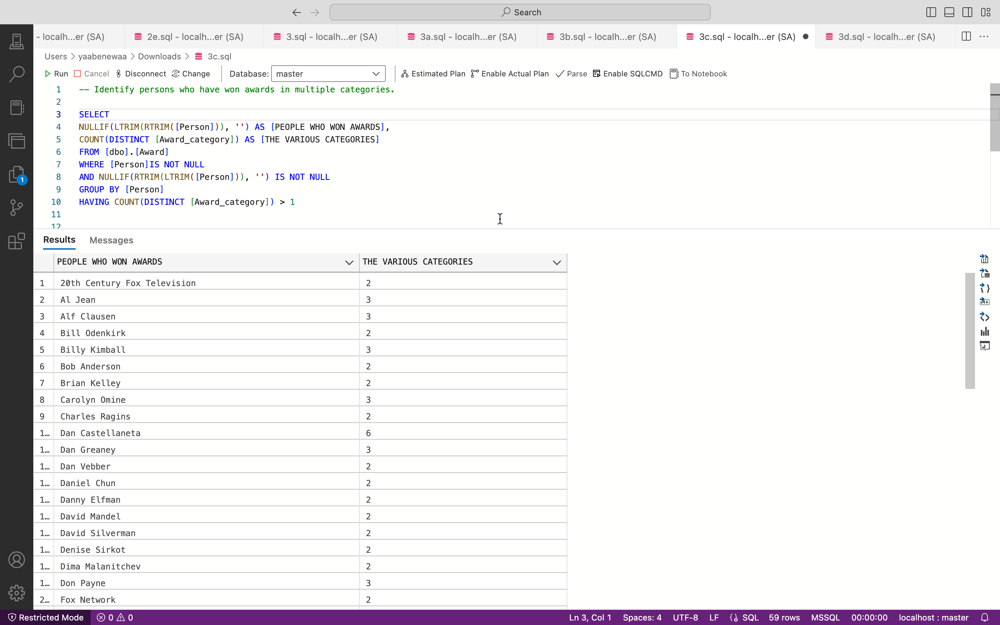

## QUESTION 18: 
## LIST THE TOP 3 MOST COMMON BIRTHPLACES IN THE "PERSON" TABLE.
# Understanding the top 3 most common birthplaces contributes to a nuanced appreciation of the series' personnel. This insight can inform decisions related to storytelling, character development, and casting, allowing creators to embrace and celebrate the diversity represented in the team. It fosters an inclusive narrative that resonates with a broader audience and enriches the overall viewing experience.

## CODE
SELECT TOP 3 NULLIF(LTRIM(RTRIM([birth_place])), '') AS cleaned_birth_place, COUNT(*) AS birthplace_count FROM [dbo].[Person] WHERE [birth_place] IS NOT NULL AND NULLIF(LTRIM(RTRIM([birth_place])), '') IS NOT NULL GROUP BY NULLIF(LTRIM(RTRIM([birth_place])), '') ORDER BY birthplace_count DESC;

## OUTPUT
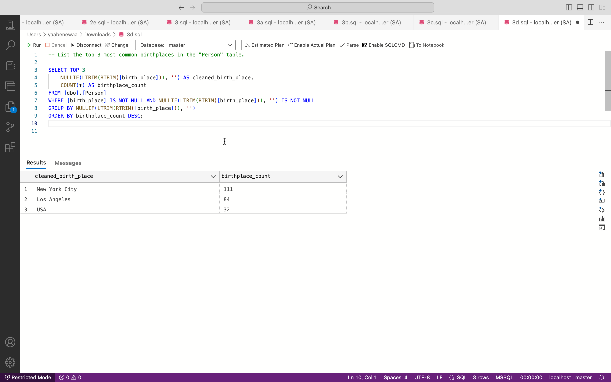

## QUESTION 19: 
## FIND THE EPISODE WITH THE MOST KEYWORDS.
# Identifying the episode with the most keywords allows creators to recognize storytelling intricacies and thematic depth. This insight aids in highlighting episodes that offer a comprehensive narrative experience. Content creators can leverage this information for promotional strategies, emphasizing episodes with rich thematic content to enhance viewer engagement and appreciation of the series.

## CODE
SELECT TOP 1 EP.[episode] AS [EPISODE], EP.[air_date] AS [DATE AIRED],
EP.[title] AS [TITILE OF EPISODE], COUNT(KD.[keyword]) AS [EPISODE WITH THE MOST KEY PHRASE] FROM [dbo].[Keyword] KD JOIN [dbo].[Episode] EP ON KD.[episode_id] = EP.[episode_id] GROUP BY EP.[title], EP.[episode],EP.[air_date] ORDER BY [EPISODE WITH THE MOST KEY PHRASE] DESC

## OUTPUT
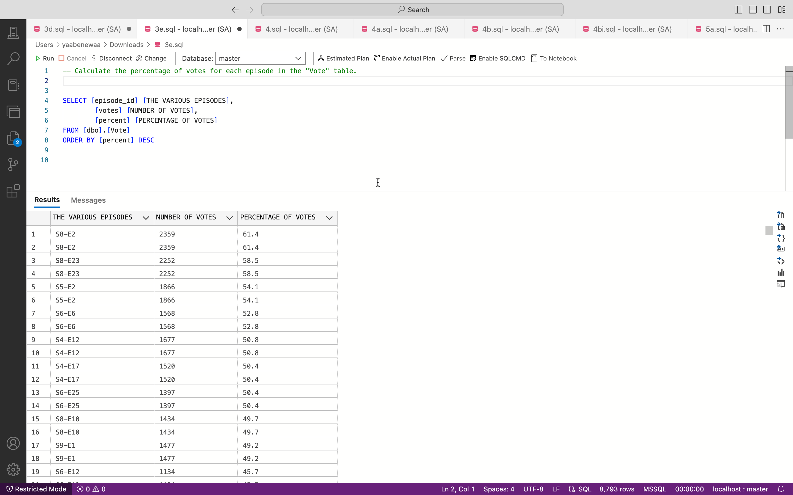

## QUESTION 20: 
## FIND THE ORGANIZATION WITH THE HIGHEST NUMBER OF AWARDS IN A SPECIFIC YEAR.
# Identifying the top organization in a specific year offers insights into industry leaders. This knowledge informs strategic decisions, potential collaborations, and highlights the series' impact, contributing to a nuanced understanding of its standing in the industry.

# CODE
SELECT TOP 1 [Organization] AS [ORGANIZATION], COUNT(*) AS [NUMBER OF AWARDS] FROM [dbo].[Award] WHERE [Year] = '2014' GROUP BY [Organization] ORDER BY [NUMBER OF AWARDS] DESC;

## OUTPUT

## QUESTION 21: 
## CALCULATE THE PERCENTAGE OF VOTES FOR EACH EPISODE IN THE "VOTE" TABLE.
# Analyzing vote percentages allows creators to focus on successful storytelling elements and understand audience preferences. This insight informs future content creation, enabling strategic decisions to maintain or improve viewer engagement, ensuring ongoing success for the series.

## CODE
SELECT [episode_id],
COUNT(DISTINCT [episode_id]) AS [THE VARIOUS EPISODES] ,[votes] AS [NUMBER OF VOTES]
,[percent] AS [PERCENTAGE OF VOTES] FROM [dbo].[Vote] GROUP BY [votes], [percent], [episode_id] ORDER BY [votes] DESC

## OUTPUT

## CODE
SELECT [episode_id] [THE VARIOUS EPISODES],[votes] [NUMBER OF VOTES],[percent] [PERCENTAGE OF VOTES] FROM [dbo].[Vote] ORDER BY [percent] DESC

## QUESTION 21: 
## CALCULATE THE AVERAGE NUMBER OF VOTES PER EPISODE.
# Understanding the average votes per episode aids creators in identifying audience-favored content. This insight informs strategic decisions for storytelling, promotional efforts, and potential improvements to enhance overall viewer satisfaction and the success of the series.

## CODE
SELECT 
AVG([votes]) AS [NUMBER OF VOTES PER EPISODE] FROM [dbo].[Episode]

## OUTPUT

## QUESTION 22: 
## DETERMINE THE FIRST 100 PEOPLE WITH THE MOST CREDITED ROLES IN EPISODES.
# Spotting the first 100 prolific contributors sheds light on key individuals and their diverse roles. This insight guides decisions for future collaborations, ensuring continued success and recognition within the series.

## CODE
SELECT TOP 100 CT.[person] AS [PERSON WITH THE MOST CREDITED ROLES], ED.[title] AS [EPISODE TITLE],CT.[role] AS [ROLE], CT.[credited] AS [CREDITED(TRUE OR FALSE)],
ED.[episode_id] AS [EPISODE_ID] FROM [dbo].[Credit] CT JOIN [dbo].[Episode] ED
ON CT.[Episode_id] =ED.[episode_id] ORDER BY [CREDITED(TRUE OR FALSE)] DESC

## OUTPUT

## QUESTION 23: 
## FIND THE ORGANIZATION WITH THE HIGHEST NUMBER OF AWARDS IN A SPECIFIC YEAR
# Understanding the leading organization for a specific year guides strategic decisions and potential collaborations with industry leaders. This insight deepens awareness of the series' influence and standing, shaping future initiatives for continued success.

## CODE
SELECT TOP 1 [Organization] AS [ORGANIZATION], COUNT(*) AS [NUMBER OF AWARDS] FROM [dbo].[Award] WHERE [Year] = '2014' GROUP BY [Organization] ORDER BY [NUMBER OF AWARDS] DESC;

## OUTPUT
 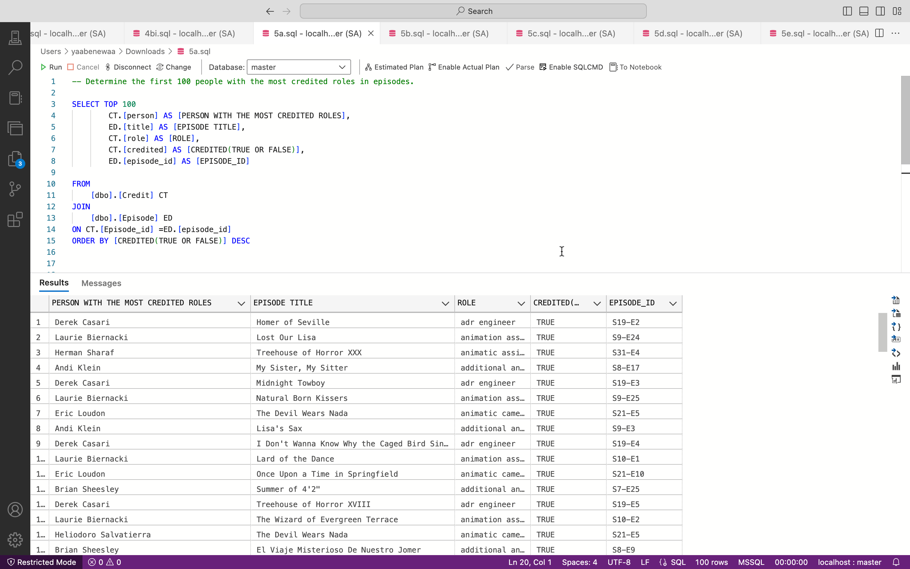

## QUESTION 24: 
## CALCULATE THE PERCENTAGE OF VOTES FOR EACH EPISODE IN THE "VOTE" TABLE.
# Analyzing vote percentages allows creators to focus on successful storytelling elements and understand audience preferences. This insight informs future content creation, enabling strategic decisions to maintain or improve viewer engagement, ensuring ongoing success for the series.

## CODE
SELECT TOP 10 NULLIF(LTRIM(RTRIM([Person])),'') AS [INDIVIDUALS],COUNT(DISTINCT [Award]) AS [TOTAL NUMBER OF AWARDS] FROM[dbo].[Award] WHERE  NULLIF(LTRIM(RTRIM([Person])),'')  IS NOT NULL  AND  [Person] IS NOT NULL GROUP BY [Person] ORDER BY[TOTAL NUMBER OF AWARDS] DESC

## OUTPUT
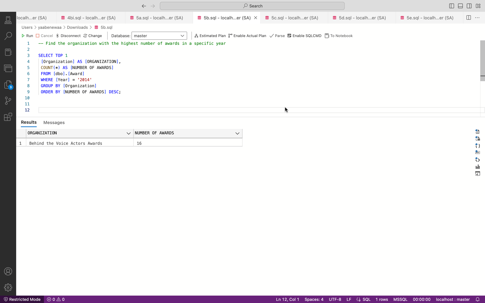

## QUESTION 25: 
## FIND THE ORGANIZATION WITH THE HIGHEST NUMBER OF AWARDS IN A SPECIFIC YEAR.
# Understanding the leading organization for a specific year guides strategic decisions and potential collaborations with industry leaders. This insight deepens awareness of the series' influence and standing, shaping future initiatives for continued success.

## CODE
SELECT ED1.[episode_id] [EPISODE_ID], ED1.[title] [EPISODE TITLE], ED2.[episode_id] [EPISODE2_ID],ED2.[title] [TITLE2_ID],ED1.[rating] FROM [dbo].[Episode] ED1 JOIN [dbo].[Episode] ED2 ON ED1.[rating] = ED2.[rating] AND ED1.[episode_id] <> ED2.[episode_id]
WHERE ED1.[episode_id] < ED2.[episode_id] ORDER BY ED1.[rating] DESC

## OUTPUT
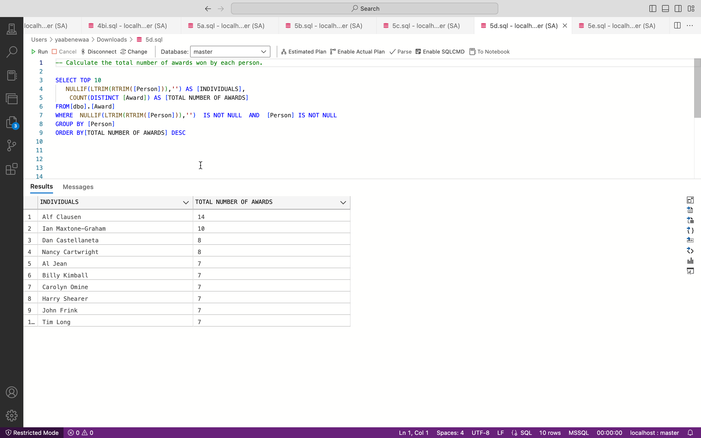

